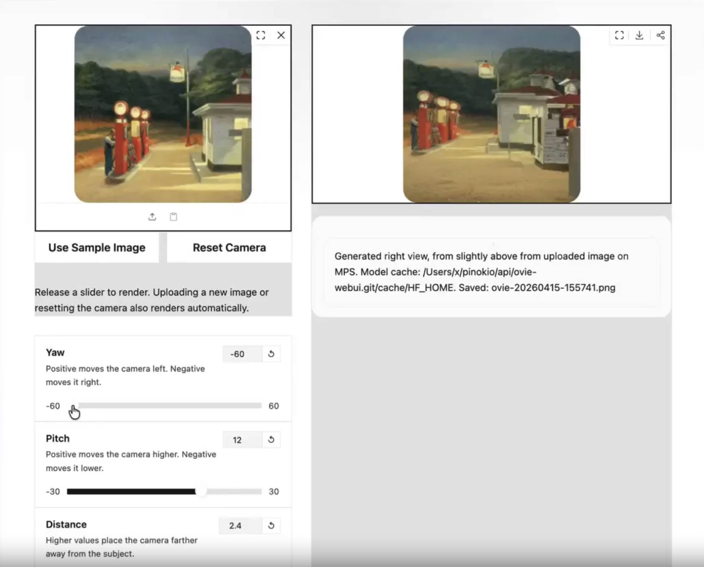

# OVIE

A Gradio Web UI for the official [kyutai-labs/ovie](https://github.com/kyutai-labs/ovie) repository.



# 1-Click Install & Launch

Use https://pinokio.co

# Manual Usage

## Install

```
uv sync --frozen
```

## Usage

```
uv run --project app python ovie_webui.py
```


# Notes

- The first inference may take a while because the launcher downloads `kyutai/ovie` from Hugging Face and warms the model.
- The launcher prefers `CUDA`, then `MPS` on Apple Silicon, then `CPU`. If an `MPS`-specific runtime error occurs during inference, it retries on `CPU`.
- The camera controls map to the same translation recipe used by the original notebook example.
- `Safe` keeps the sliders closer to OVIE's typical training-time viewpoint changes, while `Experimental` widens the bounds for stress testing.
- The UI renders automatically on page load, on image changes, and whenever you release a camera slider.
- The upstream training and preprocessing scripts in `app/` still include CUDA-specific paths and should be treated as NVIDIA-first.
- The upstream repository still includes the original notebooks in `app/`, but the launcher now exposes a normal web UI by default.
